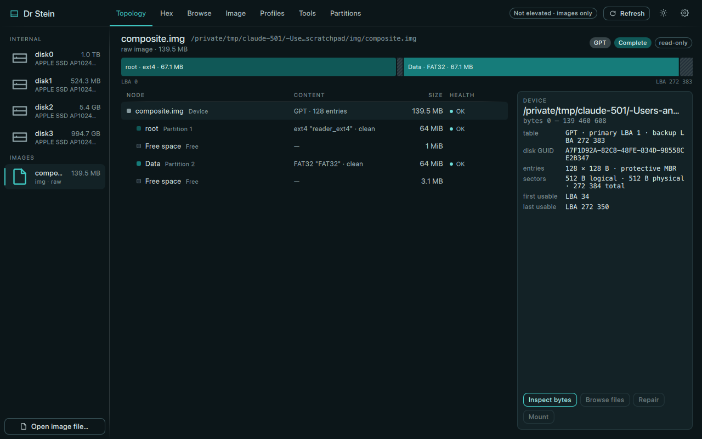

# Dr Stein

Disk and disk-image multitool: the desktop front-end of
[libstein](https://github.com/streamx3/libstein). One Qt 6 / QML codebase for
Linux, macOS and Windows; every byte-level decision is the library's.



The title bar is drawn by the app on every platform (traffic lights on macOS,
caption chips on Windows, VS Code's caption buttons on Linux); four palettes (teal, blurple, Apple blue,
grey), dark and light.

Seven views, translated from the Claude Design prototype in
[`doc/design/mockup/`](doc/design/mockup/):

| View | What it does |
|---|---|
| Topology | byte-proportional bar, the probe tree (table, partitions, containers, volumes), a details card with usage, diagnostics and actions |
| Hex | every on-disk structure the library parses (GPT headers and entries, superblocks, boot sectors) next to its bytes; field edits preview on an overlay, checksums can be recomputed, nothing is written before you say so |
| Browse | files inside ext4, FAT, exFAT, NTFS, HFS+, APFS, XFS, btrfs, ISO, UDF, SquashFS, EROFS and F2FS, in images, LUKS containers or LVM volumes, without mounting; preview, hash, copy out, or mount it for the OS |
| Image | create `.stein` or raw images of a whole device or of one partition (used blocks only, LZ4, split, encrypted); partition images record where they came from and restore into a partition; restore any supported container to a disk; verify; manage key slots |
| Profiles | the dr_stein one-button case: a disk identity plus an image, three buttons, all dry-runnable |
| Tools | surface scan (read-only) and the fake-flash capacity test (destructive, confirmed by typing the device name) |
| Partitions | create / add / edit / delete / repair / wipe on an operation stack with a live preview; applied in one pass |

Everything opens read-only. Writes go through the library's operation stack or
an explicit, identity-repeating confirmation; while a write runs, everything but
Cancel is locked. Disks and mounts appearing or vanishing are picked up by the
OS's own notifications (DiskArbitration, inotify + /proc/self/mounts,
WM_DEVICECHANGE). Without root or Administrator
rights the app lists disks but can only open image files; it says so in the top
bar.

## Building

Requirements: CMake ≥ 3.25, Ninja, a C++23 compiler (Apple clang 15+, GCC 13+,
Clang 19+, MSVC 2022), Python ≥ 3.11 (libstein's layout generator), Qt 6.7+
with the Quick, QuickControls2, QuickDialogs2 and Svg modules. Clang 18 on
Linux (Ubuntu 24.04's default) builds too, with libstein's bundled
`tl::expected` in place of the `std::expected` its libstdc++ hides, and a
configure-time warning asking for Clang 19.

Linux additionally needs `pkg-config` and `libfuse3-dev` for libstein's FUSE
mount backend; without them the build still succeeds but mounting from the app
("Mount instead" in Browse, Mount in Topology) is unavailable. On Debian and
Ubuntu derivatives:

```sh
sudo apt install build-essential cmake ninja-build pkg-config python3 libfuse3-dev
```

```sh
git clone --recurse-submodules https://github.com/streamx3/dr_stein
cd dr_stein
export QT_ROOT=$HOME/Qt/6.10.2/macos      # wherever Qt's lib/cmake lives
cmake --preset debug
cmake --build --preset debug
ctest --preset debug                     # the core's unit tests
```

The app bundle lands in `build/debug/src/app/` (`Dr Stein.app` on macOS,
`Dr Stein` elsewhere). `cmake --preset core` builds and tests the Qt-free core
alone.

In Qt Creator the presets file does two things worth knowing. The Configure
Project page lists only the kits made from the presets (`debug`, `release`,
`core`, `ci`) and hides the regular ones; they can still be enabled later in
Projects mode. And the preset kits take Qt from `QT_ROOT`, which Qt Creator
reads from its own environment: set it under Preferences > Environment >
System (for example `QT_ROOT=$HOME/Qt/6.11.2/gcc_64`), then Build > Reload
CMake Presets. A kit's compiler must be one from the list above; Qt Creator
may pick Clang 18 on its own, which only builds through the fallback.

To work on a real disk, launch elevated:

```sh
sudo "build/debug/src/app/Dr Stein.app/Contents/MacOS/Dr Stein"
```

Image files (`.stein`, raw, split raw, qcow2, VHD, VHDX, VMDK, VDI, E01, DMG)
need no privileges and can be passed on the command line.

## Layout

```
libstein/        the library, a git submodule (no Qt in it)
src/core/        drstein_core: Qt-free application logic over libstein, with doctest tests
src/qt/          QObject facades and models that QML binds to
src/app/         main.cpp and the QML module (Theme, components, views, dialogs)
src/app/icons/   the app icon (SVG, .ico, .icns; see its README) and the Linux caption-button glyphs
doc/design/      architecture, the mockup → QML translation notes, the mockup itself, screenshots
```

The architecture is described in
[`doc/design/01-application-architecture.md`](doc/design/01-application-architecture.md);
the theme tokens and the deviations from the mockup in
[`doc/design/02-ui-translation.md`](doc/design/02-ui-translation.md).

## Scripted runs

For smoke tests and screenshots without clicking:

```sh
DRSTEIN_VIEW=hex DRSTEIN_SCREENSHOT=/tmp/hex.png "Dr Stein" disk.img
DRSTEIN_SCRIPT="Workspace.view='tools'; toolsView.tools.surfaceScan()" DRSTEIN_DELAY=8000 \
  DRSTEIN_SCREENSHOT=/tmp/scan.png "Dr Stein" disk.img
DRSTEIN_SCHEME=light DRSTEIN_PALETTE=blue "Dr Stein"     # teal | blurple | blue | grey
DRSTEIN_CHROME=native "Dr Stein"                          # system title bar for this run
```

`DRSTEIN_EXPORT_COMPOSITE=/tmp/disk.img build/debug/src/core/drstein_core_tests -tc="export*"`
writes a 139 MB GPT disk (ext4 + FAT32 from libstein's fixtures) to play with.

## Status

Every view is wired to the library and exercised against image files:
imaging (create, verify, restore byte-identical), partition editing with
apply, hex edits with checksum repair, browsing with preview, hash and copy
out, NFS loopback mounts on macOS, surface scans, profile backups. Not done
yet: a privileged helper (the library's plan) and SMART. Linux builds and
runs on Mint 22.1 / GCC 13 / Qt 6.11 (see `doc/design/05-linux-bringup.md`);
the Windows build follows libstein's CI but has not been run by hand.

License: MIT. The Linux caption-button glyphs are Microsoft's
[Codicons](src/app/icons/codicons/README.md), CC-BY 4.0.
